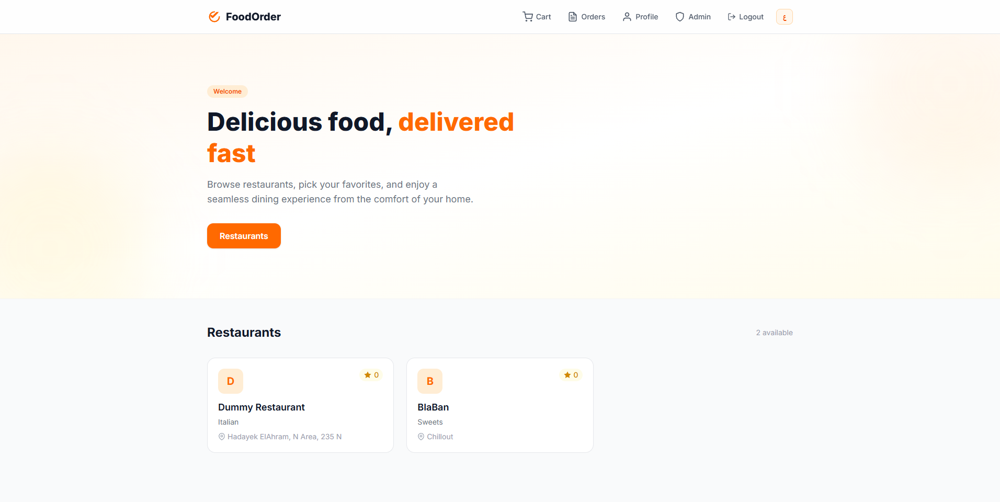
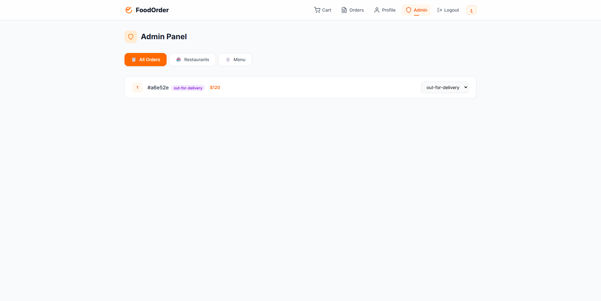
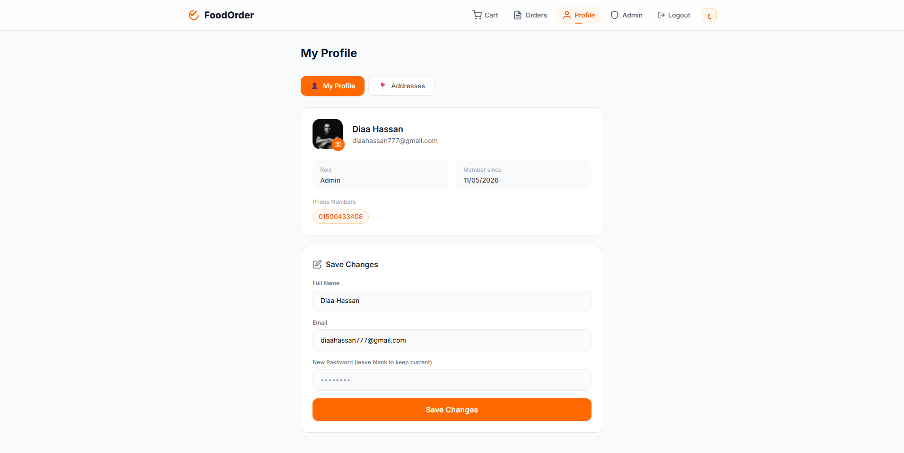

# FoodOrder 🍽️

A full-stack online food ordering platform built with **React 19**, **Express 5**, and **MongoDB**. Users can browse restaurants, order food, track deliveries, and manage their profile — with admin controls for restaurants and menu items.

## ✨ Features

- **User authentication** — email/password and Google OAuth with JWT + OTP verification
- **Restaurant browsing** — search restaurants, filter by cuisine, view ratings
- **Menu ordering** — browse menu items with category filtering, add to cart
- **Order management** — place orders, track status (placed → preparing → out-for-delivery → delivered)
- **Payment processing** — Cash on Delivery or online card payment
- **User profile** — manage personal info, phone numbers, addresses, profile picture
- **Admin dashboard** — manage orders, restaurants, and menu items
- **Multi-language** — English and Arabic (RTL) support with i18next
- **Image upload** — profile pictures and menu item images uploaded to AWS S3

## 🖼️ Screenshots

| Home Page | Sign In | Sign Up |
|:---:|:---:|:---:|
|  |  |  |

| Cart | Orders | Admin Panel |
|:---:|:---:|:---:|
|  |  |  |

| Profile |
|:---:|
|  |

## 🏗️ Tech Stack

### Frontend (`Client/`)

| Technology | Purpose |
|---|---|
| React 19 | UI framework |
| Vite 8 | Build tool |
| Tailwind CSS 4 | Styling |
| React Router 7 | Client-side routing |
| Axios | HTTP client |
| i18next | Internationalization |
| @react-oauth/google | Google OAuth |

### Backend (`Server/`)

| Technology | Purpose |
|---|---|
| Express 5 | HTTP server |
| TypeScript | Type safety |
| MongoDB + Mongoose 9 | Database |
| Redis (Upstash) | Token revocation & caching |
| Zod 4 | Request validation |
| JWT | Authentication |
| Nodemailer | Email (OTP) |
| Multer | File upload handling |
| AWS S3 SDK | Image storage |

## 🚀 Getting Started

### Prerequisites

- Node.js 20+
- MongoDB connection string
- Redis URL (Upstash or local)
- AWS S3 bucket with credentials

### 1. Clone the repository

```bash
git clone https://github.com/DiaaEldinHassan/Online-Food-Order-App.git
cd Online-Food-Order-App
```

### 2. Backend setup

```bash
cd Server
npm install
```

Create `Server/src/config/.env.dev`:

```env
PORT=3000
DB_URI=mongodb+srv://<user>:<pass>@cluster/db
REDIS_URL=rediss://default:<token>@<host>:6379
ACCESS_SECRET_KEY=<your-secret>
REFRESH_SECRET_KEY=<your-secret>
SALT=12
ENCRYPTION_SK=<your-encryption-key>

S3_REGION=us-east-1
S3_BUCKET_NAME=your-bucket
S3_ACCESS_KEY=AKIA...
S3_SECRET_ACCESS_KEY=...
S3_EXPIRATION_TIME=120

NODEMAILER_ACCOUNT=your-email@gmail.com
NODEMAILER_PASSWORD=your-app-password
GOOGLE_CLIENT_ID=your-google-client-id
APP_NAME=FoodOrder
NODE_ENV=development
```

```bash
npm run start:dev
```

### 3. Frontend setup

```bash
cd Client
npm install
npm run dev
```

Open `http://localhost:5173` in your browser.

## 📁 Project Structure

```
Online Food Ordering/
├── Client/                    # React frontend
│   ├── public/
│   ├── src/
│   │   ├── api/              # Axios API modules
│   │   ├── components/       # Shared components (Navbar, ProtectedRoute)
│   │   ├── context/          # AuthContext
│   │   ├── i18n/             # Translations (en, ar)
│   │   ├── pages/            # Route pages
│   │   └── assets/           # Static assets
│   └── index.html
├── Server/                    # Express backend
│   ├── src/
│   │   ├── common/           # Utilities, errors, enums, templates
│   │   ├── config/           # Environment config
│   │   ├── db/               # Mongoose models & connection
│   │   ├── middleware/       # Auth, validation, error handling, rate limiting
│   │   └── modules/          # Feature modules (auth, menu, cart, order, etc.)
│   └── app.bootstrap.ts      # App entry point
└── Screenshots/               # Screenshots for README
```

## 📄 License

MIT
